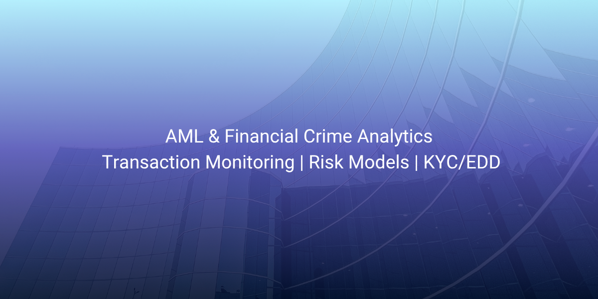

## About Me

I am an Anti-Money Laundering (AML) and financial crime compliance professional with over nine years of experience in Canadian financial institutions and fintech/crypto advisory environments. My focus is on transaction monitoring, risk assessment, regulatory compliance, and the application of data analytics to strengthen financial crime detection and control frameworks.

I specialize in translating AML and risk requirements into practical, data-driven solutions that enhance monitoring effectiveness and support regulatory expectations.

### 🔍 Areas of Expertise
**Anti-Money Laundering & Financial Crime**

Transaction monitoring design and analysis
AML risk assessment and typology development
Customer due diligence (CDD/KYC/EDD)
Suspicious transaction analysis and reporting support
Regulatory compliance and FINTRAC-aligned frameworks

**Anti-Money Laundering & Financial Crime**

Transaction monitoring design and analysis
AML risk assessment and typology development
Customer due diligence (CDD/KYC/EDD)
Suspicious transaction analysis and reporting support
Regulatory compliance and FINTRAC-aligned frameworks

**Risk & Analytics**

Transaction monitoring logic and scenario development
Customer and country risk scoring models
Pattern detection and anomaly identification
AML control testing and effectiveness review
Data-driven risk segmentation

**Business & Operational Insight**

Process optimization and control improvement
Financial and operational performance analysis
Data-driven decision support

**Transaction monitoring logic and scenario development**
Customer and country risk scoring models
Pattern detection and anomaly identification
AML control testing and effectiveness review
Data-driven risk segmentation

**Business & Operational Insight**

Process optimization and control improvement
Financial and operational performance analysis
Data-driven decision support

### 📊 Projects
This repository contains AML and financial crime–focused analytics projects, including:

Transaction monitoring logic simulations using SQL
AML risk scoring and segmentation models
Typology-based detection scenarios (layering, structuring, etc.)
High-risk jurisdiction transaction analysis
Data cleaning and transformation for compliance datasets
Risk-based alerting and anomaly detection concepts

All projects are designed to reflect real-world AML and financial crime use cases rather than purely academic exercises.

### 🛠️ Tools & Skills
SQL (data querying, risk logic, segmentation)
Excel (analysis, reconciliation, reporting)
Power BI (dashboards, risk visualization)
AML frameworks and financial crime methodologies
Risk modeling and transaction monitoring concepts

### 📫 Let’s Connect
- LinkedIn: www.linkedin.com/in/kimberleyhunt24

